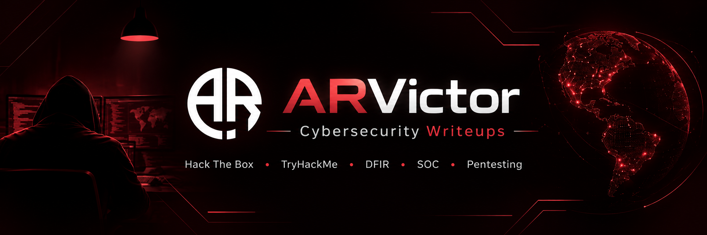

<p align="center">
  
</p>

<h1 align="center">ARVictor | Cybersecurity Writeups</h1>

<p align="center">
  Practical cybersecurity writeups, investigation notes, techniques, and learning documentation from
  <strong>Hack The Box</strong> and <strong>TryHackMe</strong>.
</p>

<p align="center">
  <a href="https://github.com/AazafRitha">
    
  </a>
  
  
  
</p>

---

## About This Repository

This repository documents my hands-on cybersecurity learning across **Hack The Box** and **TryHackMe**.

The purpose is not simply to store answers, flags, or copied platform content.

Each writeup focuses on the technical process used to understand and solve a lab:

```text
Identify
   ↓
Enumerate / Investigate
   ↓
Analyze
   ↓
Exploit / Detect
   ↓
Validate
   ↓
Document
   ↓
Learn
```

My goal is to keep every writeup:

- clear and easy to understand;
- technically accurate;
- reproducible where appropriate;
- focused on useful techniques;
- concise without unnecessary platform information;
- useful as a personal cybersecurity knowledge base.

---

## Repository Navigation

| Section | Description | Explore |
|---|---|---|
| Hack The Box | Machines, Sherlocks and Challenges | [View HTB →](./hackthebox/README.md) |
| TryHackMe | Rooms and Challenges | [View THM →](./tryhackme/README.md) |
| Resources | Reusable commands, methodology and security notes | [View Resources →](./resources/README.md) |
| Templates | Standard formats used for new writeups | [View Templates →](./templates/) |

---

# Hack The Box

My Hack The Box documentation is divided into **Machines**, **Sherlocks**, and **Challenges**.

## Machines

| Difficulty | Writeups |
|---|---|
| Easy | [Browse →](./hackthebox/machines/easy/) |
| Medium | [Browse →](./hackthebox/machines/medium/) |
| Hard | [Browse →](./hackthebox/machines/hard/) |
| Insane | [Browse →](./hackthebox/machines/insane/) |

Typical areas covered:

`Enumeration` · `Web Security` · `Initial Access` · `Privilege Escalation` · `Linux` · `Windows` · `Active Directory`

---

## Sherlocks

| Difficulty | Writeups |
|---|---|
| Very Easy | [Browse →](./hackthebox/sherlocks/very-easy/) |
| Easy | [Browse →](./hackthebox/sherlocks/easy/) |
| Medium | [Browse →](./hackthebox/sherlocks/medium/) |
| Hard | [Browse →](./hackthebox/sherlocks/hard/) |
| Insane | [Browse →](./hackthebox/sherlocks/insane/) |

Typical areas covered:

`DFIR` · `SOC Analysis` · `Incident Response` · `Log Analysis` · `Windows Forensics` · `Network Forensics` · `Malware Analysis`

---

## Challenges

| Category | Writeups |
|---|---|
| Web | [Browse →](./hackthebox/challenges/web/) |
| Forensics | [Browse →](./hackthebox/challenges/forensics/) |
| Crypto | [Browse →](./hackthebox/challenges/crypto/) |
| Reversing | [Browse →](./hackthebox/challenges/reversing/) |
| Pwn | [Browse →](./hackthebox/challenges/pwn/) |
| OSINT | [Browse →](./hackthebox/challenges/osint/) |
| Steganography | [Browse →](./hackthebox/challenges/stego/) |
| Mobile | [Browse →](./hackthebox/challenges/mobile/) |
| Hardware | [Browse →](./hackthebox/challenges/hardware/) |
| Blockchain | [Browse →](./hackthebox/challenges/blockchain/) |
| AI / ML | [Browse →](./hackthebox/challenges/ai-ml/) |
| Miscellaneous | [Browse →](./hackthebox/challenges/misc/) |

---

# TryHackMe

The TryHackMe section contains rooms and practical challenges covering both offensive and defensive cybersecurity.

## Rooms

| Difficulty | Writeups |
|---|---|
| Easy | [Browse →](./tryhackme/rooms/easy/) |
| Medium | [Browse →](./tryhackme/rooms/medium/) |
| Hard | [Browse →](./tryhackme/rooms/hard/) |

---

## Challenges

| Category | Writeups |
|---|---|
| Web | [Browse →](./tryhackme/challenges/web/) |
| Forensics | [Browse →](./tryhackme/challenges/forensics/) |
| Crypto | [Browse →](./tryhackme/challenges/crypto/) |
| Reversing | [Browse →](./tryhackme/challenges/reversing/) |
| Pwn | [Browse →](./tryhackme/challenges/pwn/) |
| OSINT | [Browse →](./tryhackme/challenges/osint/) |
| Steganography | [Browse →](./tryhackme/challenges/stego/) |
| Miscellaneous | [Browse →](./tryhackme/challenges/misc/) |

---

# Areas of Practice

```text
Cybersecurity
│
├── Offensive Security
│   ├── Reconnaissance
│   ├── Network Enumeration
│   ├── Web Application Security
│   ├── Vulnerability Assessment
│   ├── Exploitation
│   ├── Linux Privilege Escalation
│   ├── Windows Privilege Escalation
│   └── Active Directory
│
├── Defensive Security
│   ├── SOC Analysis
│   ├── Digital Forensics
│   ├── Incident Response
│   ├── Threat Hunting
│   ├── Log Analysis
│   ├── Windows Forensics
│   └── Network Forensics
│
└── Security Research
    ├── Malware Analysis
    ├── Reverse Engineering
    ├── Cryptography
    ├── OSINT
    └── CTF Challenges
```

---

# Writeup Approach

I try to document the parts of a lab that actually matter from a cybersecurity perspective.

A typical writeup follows this structure:

```text
Overview
   ↓
Skills & Tools
   ↓
Initial Analysis / Enumeration
   ↓
Important Discovery
   ↓
Technical Analysis
   ↓
Exploitation / Investigation
   ↓
Findings
   ↓
Useful Commands
   ↓
Key Takeaways
```

I avoid repeating long descriptions, instructions, or information that is already available directly on the original platform.

---

# Recent Writeups

| Platform | Lab | Type | Category | Difficulty | Status |
|---|---|---|---|---|---|
| HTB | Baggage | Sherlock | DFIR / Windows Forensics | Very Easy | In Progress |
| HTB | PhantomRing | Sherlock | Malware / Forensics | — | In Progress |

More writeups will be added as labs are completed and publication is permitted.

---

# Resources

The [`resources`](./resources/README.md) directory contains reusable information collected while completing cybersecurity labs.

```text
resources/
│
├── cheatsheets/
├── methodology/
└── tools/
```

This section is intended to become a reusable reference for commands, investigation workflows, tools, filters, and security techniques.

---

# Templates

To keep the repository consistent, new writeups are created using reusable templates.

```text
templates/
│
├── machine/
│   └── README.md
│
├── sherlock/
│   └── README.md
│
├── challenge/
│   └── README.md
│
└── tryhackme-room/
    └── README.md
```

Each completed lab normally contains only:

```text
Lab-Name/
│
├── README.md
└── images/
```

This keeps the repository simple and easy to maintain.

---

# Repository Structure

```text
cybersecurity-writeups/
│
├── assets/
│   └── arvictor-banner.png
│
├── hackthebox/
│   ├── README.md
│   │
│   ├── machines/
│   │   ├── easy/
│   │   ├── medium/
│   │   ├── hard/
│   │   └── insane/
│   │
│   ├── sherlocks/
│   │   ├── very-easy/
│   │   ├── easy/
│   │   ├── medium/
│   │   ├── hard/
│   │   └── insane/
│   │
│   └── challenges/
│       ├── web/
│       ├── forensics/
│       ├── crypto/
│       ├── reversing/
│       ├── pwn/
│       ├── osint/
│       ├── stego/
│       ├── mobile/
│       ├── hardware/
│       ├── blockchain/
│       ├── ai-ml/
│       └── misc/
│
├── tryhackme/
│   ├── README.md
│   │
│   ├── rooms/
│   │   ├── easy/
│   │   ├── medium/
│   │   └── hard/
│   │
│   └── challenges/
│       ├── web/
│       ├── forensics/
│       ├── crypto/
│       ├── reversing/
│       ├── pwn/
│       ├── osint/
│       ├── stego/
│       └── misc/
│
├── resources/
│   ├── README.md
│   ├── cheatsheets/
│   ├── methodology/
│   └── tools/
│
├── templates/
│   ├── machine/
│   ├── sherlock/
│   ├── challenge/
│   └── tryhackme-room/
│
├── README.md
└── .gitignore
```

---

# About ARVictor

**ARVictor** is my cybersecurity alias used for hands-on security labs, CTF-style challenges, investigation exercises, and cybersecurity learning platforms.

This repository represents my continuous practical learning across both offensive and defensive security.

**GitHub:** [AazafRitha](https://github.com/AazafRitha)

**Hack The Box:** `Add ARVictor HTB profile link`

**TryHackMe:** `Add ARVictor TryHackMe profile link`

---

# Disclaimer

All content in this repository is created for **educational purposes and authorized cybersecurity environments**.

Writeups document my own learning process and are intended to demonstrate cybersecurity concepts, tools, investigation methods, and technical skills.

I do not intentionally publish real-world credentials, private information, raw malware samples, sensitive evidence, or unauthorized attack material.

Solutions are published only when sharing is permitted by the respective platform.

---

<p align="center">

### ARVictor

**Learn • Analyze • Exploit • Detect • Improve**

<br>

<a href="./hackthebox/README.md">Hack The Box</a>
&nbsp; • &nbsp;
<a href="./tryhackme/README.md">TryHackMe</a>
&nbsp; • &nbsp;
<a href="./resources/README.md">Resources</a>
&nbsp; • &nbsp;
<a href="https://github.com/AazafRitha">GitHub</a>

</p>